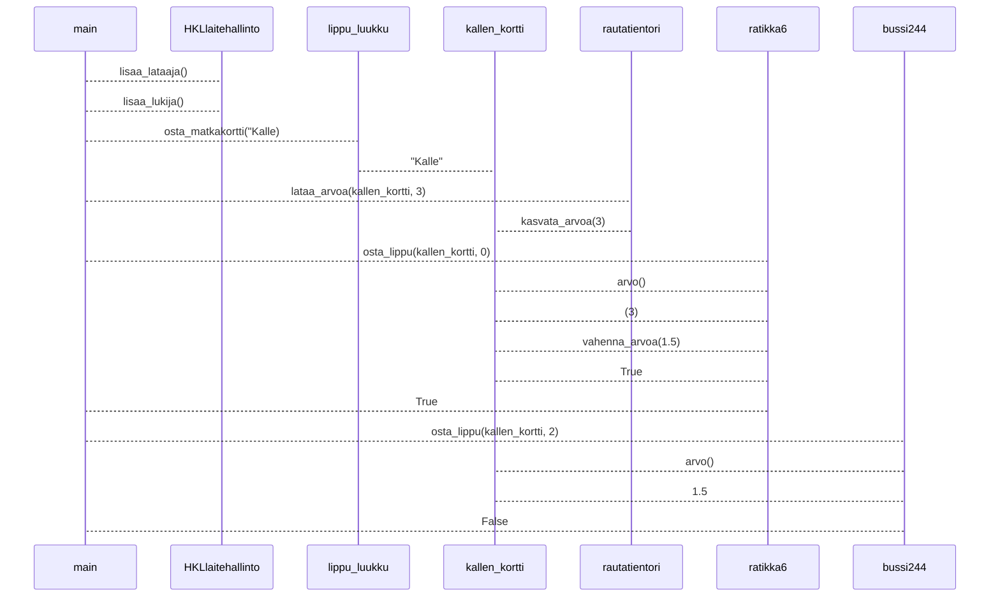

### Sekvensiskaavio

Tarkastellaan HSL-matkakorttien hallintaan käytettävää koodia.

Kuvaa sekvenssikaaviona koodin main-funktion suorituksen aikaansaama toiminnallisuus.

Muista, että sekvenssikaaviossa tulee tulla ilmi kaikki mainin suorituksen aikaansaamat olioiden luomiset ja metodien kutsut!

